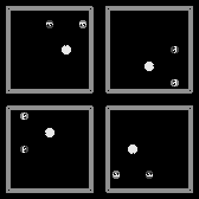

### TP-Final-Procesos-Markovianos-para-el-Aprendizaje-Automatico-2019-1C
Continues from here: https://github.com/LecJackS/Procesos-Markovianos-Para-el-Aprendizaje-Automatico-2019-1C/

### Very Quick Roadmap to
# Asynchronous Advantage Actor Critic (A3C)

### Installation

    git clone this-repo
    cd this-repo
    jupyter notebook
    
### Requires

    conda create --name myenv
    conda activate myenv
    
    conda install pytorch-cpu torchvision-cpu -c pytorch
    # To allow GPU use (not required for this project)
    #conda install pytorch torchvision cudatoolkit=9.0 -c pytorch

Other systems: https://pytorch.org/get-started/locally/

    # Other needed packages
    conda install numpy matplotlib jupyter tensorboard
    conda install -c conda-forge opencv
    pip install gym
    
Highly recommended (for this and ather projects on notebooks):
    
    # Jupyter notebook extensions
    conda install -c conda-forge jupyter_contrib_nbextensions
    
To see pretty loss plots (needs tensorboard, but not tensorflow)

    tensorboard --logdir=./gym_pacman/tensorboard

### Index

* All explanation is in [the main notebook](Very%quick%roadmap%to%Asynchronous%Advantage%Actor%Critic.ipynb)

* All action is divided in two pacman_folders:
  1. ***./cs188x_pacman***: with Berkeley's Pac-man simulator and two functional Q-agents
    
  2. ***./gym_pacman***: also with Berkeley's Pac-man with almost complete portability to Gym environments.
     
     Basically all the action is in the 2nd one, so you may want to pay attention to:
     
     *train.py* and *process.py* (heavely commented)
     
     https://github.com/LecJackS/TP-Final-Procesos-Markovianos-para-el-Aprendizaje-Automatico-2019-1C-w.o.heavy-history-/blob/master/gym_pacman/train.py
     
     https://github.com/LecJackS/TP-Final-Procesos-Markovianos-para-el-Aprendizaje-Automatico-2019-1C-w.o.heavy-history-/blob/master/gym_pacman/src/process.py
     
     *GraphicsUtils.py* for doing something more clever with the non-optional rendering of the game, 16 windows can be a lot! (right now I moved them 600 pixels) to the left of the screen)
     
     *Pacman_env* for tweaking layouts chosen, ghosts, pellets.
     
     *env.py* for rewards and input preprocessing to NN (*create_train_env*)
     
     
